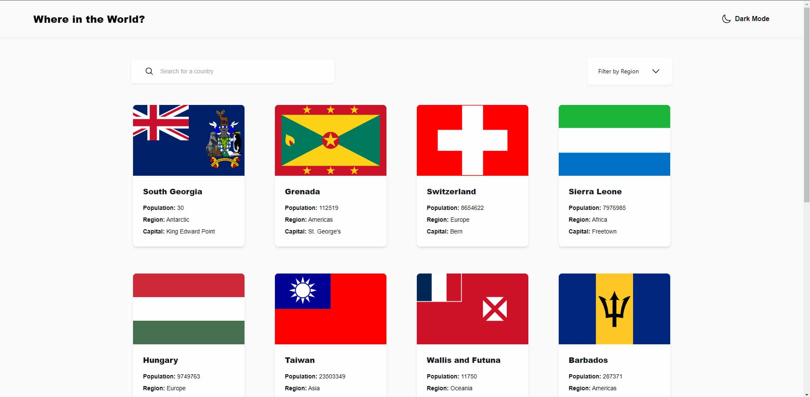

# Frontend Mentor - REST Countries API with color theme switcher solution

This is a solution to the [REST Countries API with color theme switcher challenge on Frontend Mentor](https://www.frontendmentor.io/challenges/rest-countries-api-with-color-theme-switcher-5cacc469fec04111f7b848ca). Frontend Mentor challenges help you improve your coding skills by building realistic projects. 

## Table of contents

- [Overview](#overview)
  - [The challenge](#the-challenge)
  - [Screenshot](#screenshot)
  - [Links](#links)
- [My process](#my-process)
  - [Built with](#built-with)
  - [What I learned](#what-i-learned)
  - [Continued development](#continued-development)
- [Author](#author)

## Overview

### The challenge

Users should be able to:

- See all countries from the API on the homepage
- Search for a country using an `input` field
- Filter countries by region
- Click on a country to see more detailed information on a separate page
- Click through to the border countries on the detail page
- Toggle the color scheme between light and dark mode *(optional)*

### Screenshot

### Links

- Solution URL: [Github](https://github.com/jazzielp/contries-api)
- Live Site URL: [Web](https://contries-de3xffcbk-jazzielps-projects.vercel.app/)

## My process

### Built with

- Semantic HTML5 markup
- Flexbox
- CSS Grid
- Mobile-first workflow
- [React](https://reactjs.org/) - JS library
- [Tailwind](https://tailwindcss.com/) - CSS Framework
- [Zustand](https://zustand-demo.pmnd.rs/)

### What I learned

Use the Zustand global state management tool for this project. Implement react-router-dom and be able to access multiple urls. Make various requests to the restcountries API.

### Continued development

Learn to do unit tests for react

## Author

- Website - [Jazziel Puente](https://jazziel.dev)
- Frontend Mentor - [@yourusername](https://www.frontendmentor.io/profile/jazzielp)
- Twitter - [@yourusername](https://x.com/hpuente06)